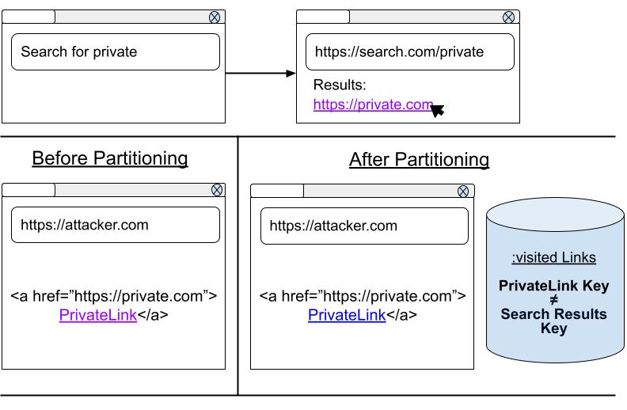
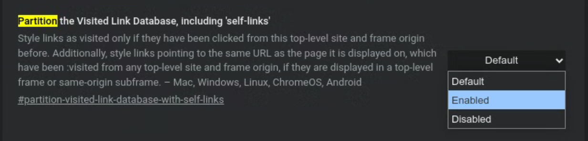

# Explainer: Partitioning :visited links history

This proposal is an early design sketch by the Chrome Platform Hardening Team to describe the problem below and solicit feedback on the proposed solution. It has not been approved to ship in Chrome.

## Author:
[Kyra Seevers](https://github.com/kyraseevers)

## Participate:
[Issue Tracker](https://github.com/kyraseevers/Partitioning-visited-links-history/issues)

## Table of Contents:
- [Introduction](#introduction)
  - [Motivation](#motivation)
  - [Goals](#goals)
  - [Non-Goals](#non-goals)
- [General API Approach](#general-api-approach)
  - [Prior Art](#prior-art)
  - [Key Scenarios](#key-scenarios)
  - [Additional Design Principles](#additional-design-principles)
- [How to Experiment](#how-to-experiment)
- [Security and Privacy](#security-and-privacy)
- [Future Work](#future-work)
- [Implementation Details](#implementation-details)
- [Alternatives Considered](#alternatives-considered)
- [References and Acknowledgements](#references-and-acknowledgements)

## Introduction:
Browsers keep track of the pages that a user has visited, and they use this information to style anchor elements on a page differently if a user has visited that link before. Most browsers give visited links a different color by default; some web developers rely on the [:visited CSS selector](https://drafts.csswg.org/css2/#selectordef-visited) to style visited links according to their own preferences. 

It is well-known that styling visited links differently from unvisited links opens the door to [side-channel attacks that leak the user’s browsing history](https://www.usenix.org/system/files/conference/woot18/woot18-paper-smith.pdf?ref=https://githubhelp.com). One [notable attack](https://blog.mozilla.org/security/2010/03/31/plugging-the-css-history-leak/) used `window.getComputedStyle` and the methods that return a NodeList of HTMLCollection of anchor elements (e.g. `document.querySelectorAll`, `document.getElementsByTagName`, etc.) to inspect the styles of each link that was rendered on the page. Once attackers had the style of each link, it was possible to determine whether each link had been visited, leaking sensitive information that should have only been known to the user.

In 2010, [browsers implemented a mitigation](https://developer.mozilla.org/en-US/docs/Web/CSS/Privacy_and_the_:visited_selector) for this attack: (1) when sites queried link styling, the browser always returned the “unvisited” style, and (2) developers were now limited in what styles could be applied to links. However, these mitigations were complicated for both browsers to implement and web developers to adjust to, and there are proponents of removing these mitigations altogether.

## Motivation:
Since 2010, the number of side-channel attacks to leak the user’s browsing history from :visited links styling has grown, including user interaction attacks, timing attacks, pixel color attacks, and process-level attacks [1]. While these attack vectors are slowed down by the [2010 mitigations](https://developer.mozilla.org/en-US/docs/Web/CSS/Privacy_and_the_:visited_selector), they are not eliminated; browsers are still actively leaking user browsing history today.

Until browsers remove the visible differences between visited and unvisited links on a user’s screen, or the information provided to attackers via these side-channel attacks is no longer valuable, browsers have no robust defense against attackers who want to obtain information about a user’s private browsing history.

## Goals:
- Improve user privacy by eliminating :visited links history leaks.
- Ensure the information available via side-channel attacks on :visited links is no longer valuable or net-new to attackers. 
- Prevent browser history from being used as a cross-site tracking vector.
- Avoid browser performance regressions by keeping common actions, like :visited links memory management and lookup, highly performant.
- Avoid losing user browsing history where possible (i.e. make efforts to retain and/or replenish unpartitioned visited links that would be lost in a partitioned table).

## Non-Goals:
- This document does not deprecate the :visited links selector. It merely limits which links may be colored as visited on the page.
- This document does not propose methods to reduce complexity in CSS parsing related to the 2010 mitigations. This is covered in the Future Work section below.

## General API Approach:
To meet our stated goals, we propose partitioning :visited links history. For the purpose of this document, partitioning is defined as storing visited links history via partition key, rather than just by the link URL. When a renderer queries the stored visited links, only queries that match all the elements of the partition key may be colored as visited on the page. On the user’s end, this will mean that the browser styles links as :visited if and only if they have been visited from this site and frame before.

Our partition key will be `triple-keyed` or store three pieces of information: the `link’s URL`, the `top-level site`, and the `origin of the frame` where the link is rendered.

1. The renderer determines the partition key for each link on the page.
2. The renderer asks if the partition keys are stored in :visited Links.
3. If :visited Links contains an entry matching all parts of the partition key, it allows the renderer to color the link as visited.

### An Exception: Self Links
We have received many feature requests for "self links" which can broadly be defined as an anchor element which links to a site’s own pages. Expressed in terms of a triple-key, it is a key of: <link url, link url, link url>. Let's consider the following scenario, where a user navigates to site foo.com which displays a link to bar.com. The user then clicks on the link to bar.com. One might assume that any links to bar.com on bar.com itself would be styled as :visited. However, with the partitioning model described above, the triple key from the user's click would be <bar.com, foo.com, foo.com>. This does not match the triple-key of the self link <bar.com, bar.com. bar.com>, and so these self links would not be styled as :visited.

Interestingly, a site will know whether a user has visited its subpages - this is information about user behavior it already has. Thus, we can reasonably propose an exception for self links into our partitioning model without sacrificing user privacy. In the self-links partitioning model, a link pointing to the same URL as the page it is displayed on, which has been :visited from any top-level site and frame origin, may be styled as :visisted if and only if it is displayed in a top-level frame or same-origin subframe. This restriction to top-level frames or same-origin subframes prevents cross-origin leaks. Thus, the only change architecturally is the addition of a <link_url, link_url, link_url> key to the partitioned hashtable for each valid <link_url, top_level_site, frame_origin> we come across in a top-level frame or same-origin subframe.

## Prior Art:
There have been many proposals to reduce the amount of user browsing history leaked by :visited links. Proposals written before 2011 are well summarized by Weinberg et. al. in Section IV: “F. Discussion” of [I Still Know What You Visited Last Summer: Leaking Browsing History via User Interaction and Side Channel Attacks.](https://ieeexplore.ieee.org/document/5958027)

#### “Domain Tagging” and “Same-Origin Bounding”
One potential solution is for browsers to style links as :visited if and only if they are same-domain, same-site, or same-origin with the current page. 

Russell (2015) proposes that same-origin boundedness will render side channel attacks obsolete: “if a user has visited a site before … the server's logs could already identify which URLs at the origin they've navigated to. This means there's no reason to prevent exposing which same-origin URLs are visited” [2]. Clover (2002) suggested this solution is infeasible due to its “severe blow to the functionality and usability expected of visited links” [3]. However, Russell asserts that user expectations regarding visited links are not well understood [2].

Ultimately, this potential solution did not align with our goal to “avoid losing user browsing history where possible.” Users would lose a significant amount of their global visited link history, as sites often contain cross-site links. However, we felt that limiting which links could be safely styled as visited was a step in the right direction. Our proposed solution is similar to Russell’s 2015 “Same-origin + Path-visited (aka: "Knowably Visited")”, which also styles links “which could have been previously discovered through logging (forward via clicks, or backward via referrer)” [2]. This potential solution preserved much more of the user’s existing browsing history.

#### “SafeHistory”
Another potential solution is for browsers to style links as :visited if and only if they are same-domain with the current page, have been previously visited from this site, or are on a custom allowlist.

Proposed by Jackson et. al. in 2006, this solution is still vulnerable to pixel color and user-interaction attacks, due to the inclusion of allowlist links that are not same-domain or previously visited from this site [4][2]. Weinberg et. al. (2011) claim this solution “sacrifices what is arguably the most useful case of visited-link indications (when a new-to-the-user site links to a document they have already seen)” [5]. However, once again, according to Russell, user expectations regarding visited links are not well understood [2]. We suspect that, as the web ecosystem has evolved, users have come to associate visited links with those they have clicked on this page before, rather than a site they may have visited from any context in the past.

Ultimately, this potential solution did not align with our goal to “improve user privacy by reducing the amount of history leaked by :visited links.” We felt the addition of an allowlist enabled significant privacy leaks. However, we felt that limiting :visited link styling to links previously visited from this site was a concept we wanted to build on for our proposed solution.

## Key Scenarios:

### Scenario #1: Partitioning Protects Against User-Interaction, Timing, and Pixel Color Attacks

  
<em>A user searches for private.com and clicks on the `https://private.com` link from the `https://search.com/private` results page. Before partitioning, this meant that any site, for example `https://attacker.com`, that embedded `https://private.com` as an anchor element could see if a user had visited it from the search results before. After partitioning, the links on `https://attacker.com` and `https://search.com/private` have different partition keys, as they have different frame origins and top-level sites. So the partitioned link is not styled as :visited - no longer leaking history to `https://attacker.com`.</em>

Attackers employ user-interaction, timing, and pixel color side-channel exploits to gain the user’s browsing history. Currently, a styled :visited link reveals that a user has visited that site anywhere on the web (from a click on a third-party site, from a bookmark, from typing it into the omnibox). This is information that `https://attacker.com` does not already have. However, sites that embed anchor elements can already determine when a user clicks on a link, and what is embedded in that link. So by partitioning :visited links and limiting coloring to links clicked from this site and frame before, we are not leaking any history that an `https://attacker.com` does not already know.

As a result, partitioning :visited links eliminates its value to attackers, while maintaining the navigational benefits for users. 

### Scenario #2: Triple-Key Partitioning Protects Against Cross-Site Tracking
!["Our example consists of two sites. The first site, https://www.lorem.com, contains an iframe that displays https://www.foo.com. The iframe contains an anchor element (named “Lorem-Iframe Link”) to https://link.example that is styled as visited. The resulting partition key contains a Link URL value of https://link.example, a Top-Level Site value of https://lorem.com, and a Frame Origin value of https://www.foo.com. This is compared to the second site, https://www.ipsum.com, which contains an iframe that also displays https://www.foo.com. The iframe also contains an anchor element to https://link.example (named “Ipsum-Frame Link”), but this link is not styled as visited. The second site’s partition key contains a Link URL value of https://link.example, a Top-Level Site value of https://ipsum.com, and a Frame Origin value of https://www.foo.com.](./img/ExplainerImage3.jpg)  
<em>A user clicks “Lorem-Iframe Link.” Even though both frames display the same origin and have a link to `https://link.example`, only the “Lorem-Iframe Link” is styled as visited, as they have different top-level sites.</em>

The top-level site in a triple-key partition keeps history confined to the top-level site it was clicked on and prevents cross-site tracking. Otherwise documents from `https://www.foo.com` embedded by different top-level sites will have access to the same :visited link history, effectively creating an equivalent to the third-party cookie.

### Scenario #3: Triple-Key Partitioning Protects Against Mainframe History Leaks
!["Our example consists of a site, https://www.foo.com, that contains both an anchor element (named “Mainframe Link”) that points to https://link.example and an iframe that displays https://www.bar.com. The iframe also contains an anchor element (named “Subframe Link”) to https://link.example. “Mainframe Link” is styled as visited but “Subframe Link” is not. The mainframe partition key contains a Link URL value of https://link.example, a Top-Level Site value of https://foo.com, and a Frame Origin value of https://www.foo.com. The subframe partition key contains a Link URL value of https://link.example, a Top-Level Site value of https://foo.com, and a Frame Origin value of https://www.bar.com."](./img/ExplainerImage4.jpg) 
<em>A user clicks “Mainframe Link.” Even though both frames have a link to `https://link.example`, only the mainframe link is colored as visited, as they have different 
frame origins.</em>

The frame origin in a triple-key partition keeps history confined to the frame it is visited in. Otherwise, any content embedded in a site can determine the history of its embedder; this leak of information would be inconsistent with the same-origin policy which ensures that cross-site iframes don't get access to the state of their embedder, and vice versa.

## Additional Design Principles
#### Clicks and Scripted Navigations vs. Other Navigations
In our proposed design, :visited links history would only contain user browsing history initiated from link clicks and scripted navigations. All other navigations (e.g. typing a site into the address bar, navigating to a site from your favorites, etc.) would not be recorded in the :visited links database. All other navigation types cannot be properly attributed to a partition (as they have no top-level site or frame origin). As a result, including these sites in the database, unpartitioned or with a “best-guess” partition, would leak information.

#### Storing Partitioned Keys Before Launch
To ensure that the transition between unpartitioned and partitioned :visited links history is as smooth as possible for users, we intend to spend a period of time before launch storing newly visited links as both partitioned and unpartitioned in the database. While this temporarily increases the size of the database, it also ensures that the browser can store complete information about recently visited links before the feature launches.

#### Preventing Leaks From Renderer Compromises
For browsers that store :visited links in the renderer, process-level attacks like SpectreJS have the potential to leak user browsing history in the event of a renderer compromise. We intend to address this issue by implementing "per-origin salts." When we construct the partitioned :visited links hashtable, we will input a salt corresponding to the link's frame origin to the hash. Each salt will be 1:1 with a specific origin, and these salts will be kept in the browser process alone. When a navigation to that frame origin occurs, we will notify the resulting renderer process ONLY of its corresponding salt. Without the salt, the hashtable values cannot be queried. The result is a hashtable which is "unreadable" except for the entries that match the renderer process' origin - rendering obsolete the usefulness of any renderer compromises to obtain this table information.

## How to Experiment:
Users can experiment with a prototype of the solution described above beginning in Chrome Version 132. However, **please note that this is intended for experimentation purposes and is subject to change as a specification takes shape and develops**. For example, partitioning support for context click :visisted links was not added until Chrome Version 133.

To experiment with the partitioned :visited links model (with self links), choose one of the following methods: 
1. Navigate to [chrome://flags/#partition-visited-link-database-with-self-links](chrome://flags/#partition-visited-link-database-with-self-links). Select "Enabled" from the dropdown on the right and restart the browser.  

**OR**

2. Run Chrome from your command line with **blink::features::PartitionVisitedLinkDatabaseWithSelfLinks** enabled.

**OR**

3. Turn on [Experimental Web Platform features as described in this article](https://developer.chrome.com/docs/web-platform/chrome-flags#two_other_ways_to_try_out_experimental_features) - please note, however, that this enables ALL of the web platform features set as experimental within Chrome.

If you experience any issues, please check first that your **Chrome version is 132 or higher**. Otherwise, please file a bug either in this repo or via [Chromium Buganizer](https://issues.chromium.org/u/2/issues/new?component=1456589&template=0) with kyraseevers@chromium.org as the assignee.

## Security and Privacy
The goal of this proposed solution is to improve user privacy by reducing the amount of history leaked by :visited links and rendering the information gained by side-channel attacks obsolete. 

Our partition key design enforces a strong privacy boundary:
- `Link URL`: the resource itself we are styling.
- `Top-Level Site`: the site of the top/main frame.
  - prevents cross-site tracking.
- `Frame Origin`: the origin of the frame where the anchor element is displayed.
  - prevents embedders from leaking history into embedded content and vice versa.
  - prevents history leaks across subdomains with different security postures.

## Future Work
#### Deprecating the 2010 CSS Mitigations
The proposed API in this explainer would improve user privacy against side-channel attacks, including those covered by the 2010 mitigations. As future work, we could deprecate the 2010 mitigations, reducing the complexity of CSS for both browsers and web developers.

## Implementation Details
While the concept of partitioning :visited links via triple key is straightforward, there is nuance in how this is implemented in Chromium. We share these implementation details to discuss our findings with other browsers and developers interested in partitioning in the hopes that they will find them helpful during their own implementation journey.
#### What types of navigations are eligible to be stored as :visited state (for Chromium)?
Any navigation which has enough information to construct a triple-key is eligible to be styled as :visited. This means that a navigation must have originated from a valid top-level site and frame origin value. Notably, in Chromium, this requires a lot of implementation nuance.
- **Self Links**: [see above](#an-exception-self-links)
- **Page Transition Type Filtering**: We only allow `LINK` and `MANUAL_SUBFRAME` transition types to be added to the `VisitedLinkDatabase`; this is because other transition types cannot be reliably attributed to a valid top-level site and/or frame origin.
- **Opening A Link In A New Tab**: Users can open a link in a new tab by right clicking on a link to open it (also called a context click) or clicking on a link which a developer has designated with `target=“_blank”`. This does result in a navigation with a `LINK` transition type, however, it does not have access to a valid previous primary main frame to populate its top-level site. Instead we use the navigation’s opener value. For `target=“_blank”` navigations, we use the live original opener chain rather than the window.opener value, as the opener relationship is also severed. As a result, the triple key is technically <link url, top-level site OR opener, frame origin>. 
- **`noreferrer` and `noopener`**: When developers designated links as noreferrer or noopener it automatically severs our access to the values usually used to populate frame origin and top-level site (for navigations without a valid previous primary main frame), respectively. As mentioned above, when window.opener is null, we fall back on the live original opener chain. We are still working on a solution for a valid noreferrer replacement.
- **Fenced Frames and Credentialless and Sandboxed Iframes**: Because each of these frames have ephemeral or no state associated with them, it is only right that they neither store nor style :visited links. Navigations coming from these frames are not stored as :visited and links displayed in these frames are not styled as :visited.
- **chrome.history.addUrl()**: For extensions, when a developer adds a URL to history via `chrome.history.addUrl()`, we add a “self-link” version of that URL to partitioned :visited history: <url, url, url>. As a result, currently, this API only supports styling links to that URL as :visited when they are on the top-level site and frame origin of the URL they provided.
- **Status Code Filtering**: Currently, Chromium filters out any navigations resulting in error codes from the `HistoryDatabase`. We have plans to alter this behavior such that error navigations can be added to partitioned :visited history.

#### When, during the navigation process, is a link added to Chromium’s :visited state?
In Chromium, partition keys are stored in two places: the VisitedLinkDatabase and the in-memory partitioned hashtable. The VisitedLinkDatabase is a table within the larger HistoryDatabase stored on a user’s profile. The VisitedLinkDatabase is in charge of persisting the partition keys across browsing sessions. Upon browser startup, the in-memory partitioned hashtable is populated from the VisitedLinkDatabase.

The in-memory partitioned hashtable exists for performance reasons, we need quick lookup time and quick insertion time on the main thread (something that the VisitedLinkDatabase does not offer). A copy of the in-memory hashtable is stored in the browser process AND in each renderer process.

When a navigation takes place, we intercept it via a NavigationThrottle to synchronously determine the navigation’s corresponding per-origin salt used to generate the fingerprint stored in our partitioned hashtable. This per-origin salt is only sent to the navigation’s corresponding process to [prevent leaks due to renderer compromises](#preventing-leaks-from-renderer-compromises). Note that we do not block the main thread here, just use the NavigationThrottle infrastructure to intercept incoming navigations.

In addition, navigations are intercepted by `HistoryTabHelper::DidFinishNavigation()` which is the entry-point to the HistoryDatabase. There, we add to both the VisitedLinkDatabase and the in-memory partitioned hashtable. When a partitioned :visited link is added to the browser-side partitioned hashtable, that link broadcasted to the renderer-side partitioned hashtable. For performance reasons, new links are grouped together and broadcasted every 100 milliseconds.

## Alternatives Considered
#### Deprecate the :visited selector 
The most obvious method of eliminating :visited history leaks is to get rid of :visited link styling entirely. As long as sites can style :link and :visited differently, there is some information about user browsing history available to side-channel attackers. 

However, we chose not to deprecate the :visited selector because we believe it provides users with useful visual cues as they navigate around the web. Our goal is to improve users’ privacy while also preserving the navigational benefits that :visited links styling provides in information-rich or link-dense environments [6]. 

In our proposed solution, we take advantage of the fact that sites can easily record which of its own anchor elements a user has visited. Our partitioning method only styles links that have been visited from this site and frame before. Therefore, our partitioning method only provides information that the site already knows. This renders any side-channel attacks obsolete, and allows us to maintain :visited links styling without revealing any additional browsing history to attackers.

#### Allow sites with permissions to style :visited links
One potential method of reducing privacy leaks is to give users control over when their information is shared. One solution would be to allow sites who ask for user permission to style :visited links.

However, this solution is highly susceptible to fraud. Sites interested in user browsing history can aggressively push users to accept their permissions, causing many users to give up privacy to reduce the annoyance. Additionally, permissions could incentivize sites to add unnecessary redirects through valuable URLs just to gain browsing history for that user and communicate that information to its other contexts.

Since this potential for fraud does not align with our goal to make side-channel attacks no longer valuable, we decided against a permissions-based approach.

#### Only style same-origin :visited links
This solution did not align with our goal to “avoid losing user browsing history where possible.” For more detail, see [“Domain Tagging” and “Same-Origin Bounding”](#domain-tagging-and-same-origin-bounding) in the Prior Art section.

## References and Acknowledgements
#### Acknowledgements
Thanks to Artur Janc, Mike Taylor, and Brianna Goldstein for their advice, expertise, and design thinking that contributed greatly to this proposal.
#### Citations
[1] A list of side-channel attacks employed to leak a user’s browsing history, grouped by type:
  #### User Interaction Attacks
  - Weinberg et al, S&P 2011: [I still know what you visited last summer](https://ieeexplore.ieee.org/abstract/document/5958027)
  - Michal Zalewski, 2013: ["Asteroids" game](https://lcamtuf.coredump.cx/yahh/)
  - Michal Zalewski, 2016: [mix-blend-mode whack-a-mole](https://lcamtuf.blogspot.com/2016/08/css-mix-blend-mode-is-bad-for-keeping.html)
  - Ron Masas, 2021: [The human side channel](https://ronmasas.com/posts/the-human-side-channel)

  #### Timing Attacks
  - Paul Stone, BlackHat 2013: [Pixel Perfect Timing Attacks with HTML5](https://owasp.org/www-pdf-archive//HackPra_Allstars-Browser_Timing_Attacks_-_Paul_Stone.pdf)
  - NDevTK: [Detecting Visited Links via Redraw Timing](https://ndev.tk/visted/)
  - Michael Smith et al, [USENIX WOOT 2018: Browser history re:visited](https://www.usenix.org/sites/default/files/conference/protected-files/woot18_slides_smith.pdf)
  - Known WONTFIX bugs: [crbug.com/252165](http://crbug.com/252165), [crbug.com/835590](http://crbug.com/835590)

  #### Pixel Stealing Attacks
  - Wang et al, 2023: [DVFS Frequently Leaks Secrets: Hertzbleed Attacks
Beyond SIKE, Cryptography, and CPU-Only Data](https://ieeexplore.ieee.org/document/10179326)
  - Taneja et al, 2023: [Hot Pixels: Frequency, Power, and Temperature Attacks on GPUs and Arm SoCs](https://doi.org/10.48550/arXiv.2305.12784)
  - Łukasz Olejnik, 2017: [Stealing sensitive browser data with the W3C Ambient Light Sensor API](https://blog.lukaszolejnik.com/stealing-sensitive-browser-data-with-the-w3c-ambient-light-sensor-api/)
  - Artur Janc: [Cross-origin data leaks via the ambient light sensor](http://arturjanc.com/ls/) 
  - Artur Janc: [True Colors](http://arturjanc.com/eyedropper)

  #### Process-Level Attacks
  - Leaking the contents of compromised renderer memory with [SpectreJS](https://chromium.googlesource.com/chromium/src/+/refs/heads/main/docs/security/side-channel-threat-model.md)

[2] Alex Russell, 2015: [Rethinking :visited-ness](https://docs.google.com/document/d/1Rnq4qZvXiuaO6KSugrXM6M7dVOpRsuOVxZBeobqeN7w/edit)

[3] Andrew Clover, 2002: [CSS visited pages disclosure](https://seclists.org/bugtraq/2002/Feb/271)

[4] Jackson et. al., 2006: [Protecting Browser State from Web Privacy Attacks](https://crypto.stanford.edu/sameorigin/sameorigin.pdf)

[5] Weinberg et al, S&P 2011: [I still know what you visited last summer](https://ieeexplore.ieee.org/abstract/document/5958027)

[6] Jakob Nielsen, 2004: [Change the Color of Visited Links](https://www.nngroup.com/articles/change-the-color-of-visited-links/)
